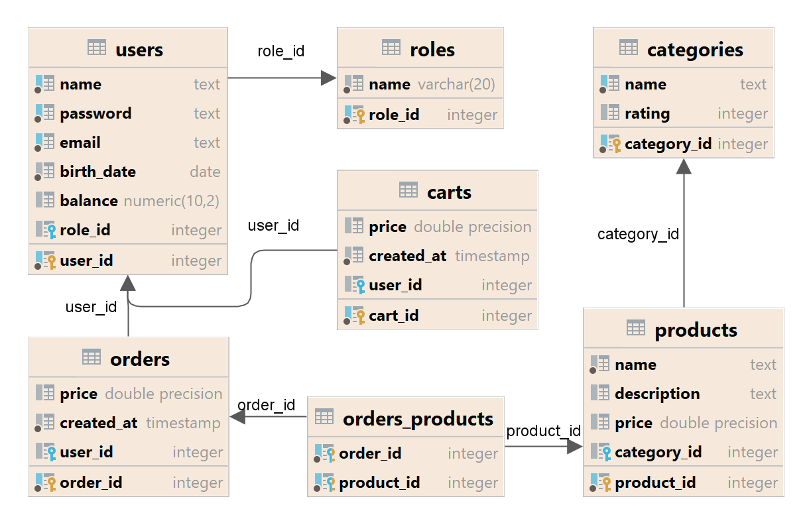

<div align="center">


<!-- Badges -->
<p>
<a>

</a>
<a>

</a>
<a>

</a>
</p>
</div>

<br />

<!-- Table of Contents -->

# :notebook_with_decorative_cover: Table of Contents

- [About the Project](#star2-about-the-project)
    * [Screenshots](#camera-screenshots)
    * [Tech Stack](#space_invader-tech-stack)
    * [Features](#dart-features)
    * [Run Locally](#running-run-locally)
    * [Database structure](#key-database-structure)
- [Roadmap](#compass-roadmap)
- [Contact](#handshake-contact)
- [Acknowledgements](#gem-acknowledgements)

<!-- About the Project -->

## :star2: About the Project

<!-- Screenshots -->

This Java application is an `E-shop` that allows users to register, authorize, and browse products by category. It utilizes
`Thymeleaf` for UI technology and is built on `Spring Boot`, `Spring MVC`, and new Java 17 technologies. 
Users can add items to their cart for purchase. The system is designed to streamline the online shopping experience
by providing a user-friendly interface and incorporating the latest Java technologies for improved functionality and security.

### :camera: Screenshots


<!-- TechStack -->

### :space_invader: Tech Stack

<details>
  <summary>Show</summary>
  <ul>
    <li><a>Java 17</a></li>
    <li><a>Spring 3.0.6 (Spring boot, Spring Security, Spring web)</a></li>
    <li><a>Maven 3.8.1</a></li>
    <li><a>Postgresql 42.6.0</a></li>
    <li><a>Lombok 1.18.24</a></li>
    <li><a>Modelmapper 3.1.1</a></li>
    <li><a>FlyWay 9.19.1</a></li>
    <li><a>ThymeLeaf 3.0.6</a></li>
    <li><a>Hibernate 6.1.7</a></li>
    <li><a>Spring data JPA 3.0.5</a></li>
    <li><a>JUnit 5</a></li>
  </ul>
</details>

<!-- Features -->

### :dart: Features

- user registration and authorization

<!-- Run Locally -->
### :running: Run Locally

Clone the project

```bash
  git clone https://github.com/Petrovich-A/E-shop.git
```

<!-- Database struct -->
### :key: Database structure



<!-- Roadmap -->
## :compass: roadmap:

* [x] building a plain Application with Spring Boot
* [x] create the User controller
* [x] plug the Hibernate
* [x] connect entities with 1:M and M:M relationships
* [x] add entities validator
* [x] add DTO and converters
* [x] add global search by product name
* [x] add User registration with saving Users to database
* [x] add User authorization
* [x] create shopping cart and opportunity to add products
* [x] add orders storing to DB
* [x] display user's order history
* [x] add the ability to view the list of products of each user order
* [x] add admin page with user's list
* [x] add Spring Security with In-Memory Authentication
* [x] add Spring Security authentication form Login custom page with Database
* [x] add Spring Security roles

## :handshake: Contact

Petrovich Alexandr - [@Petrovich Alexandr](https://www.linkedin.com/in/alexandr-petrovich/) - a.piatrovich@gmail.com

<!-- Acknowledgments -->

## :gem: Acknowledgements

Here are useful resources for readme writing and designing that I've used in my projects.

- [Shields.io](https://shields.io/)
- [Awesome README](https://github.com/matiassingers/awesome-readme)
- [Templates for UI](https://www.w3schools.com/howto/default.asp)
- [Git Emoji for your commit messages](https://gitmoji.dev)
- [Readme Template](https://github.com/othneildrew/Best-README-Template)
- [Technical support](https://www.baeldung.com)